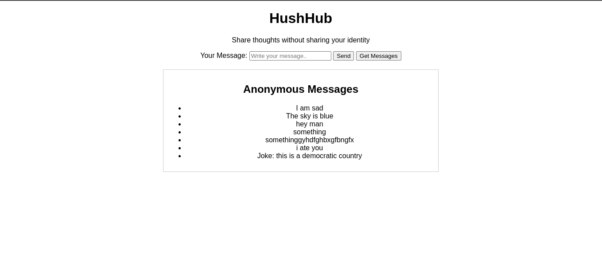

<div align="center">

# Hush Hub
*Share thoughts wihtout letting them know who you are*


&nbsp;
&nbsp;
&nbsp;
</div>

see [demo snap](#demo),

see [HushHub Backend](https://github.com/ashraf-minhaj/HushHub-Backend)

### Features
- [x] Dockerize Application 
- [x] Docker Hot reloading for local development 
- [x] Multistage build 
- [x] Separate credentials for local dev and production (.env)
- [x] Local docker image 
- [x] Pull/push from the docker hub 
- [x] Log formatting (Configure logging in application) 
- [x] Docker tool to wrap complex docker commands in a simpler format 

### Improvement scopes (future considerations)
- application health check monitoring and notification system
- test scripts to catch bugs at early stage
- CI/CD
(more to come)

### Demo


## setup local environment

- Install latest version of docker in your system
- Install python3 on your system (should come with your distro BTW)

- Setup devtool. Go to 'tools' dir and run -
    ```
        $ pip3 install .
    ```

- Now run the tool from your 'app' directory. 
    ```
        $ devtool run --app-name devfrontend
    ```

- example `devtool --help` -
    ``` 
        Usage: devtool [OPTIONS] COMMAND [ARGS]...

        Options:
        --install-completion [bash|zsh|fish|powershell|pwsh]
                                        Install completion for the specified shell.
        --show-completion [bash|zsh|fish|powershell|pwsh]
                                        Show completion for the specified shell, to
                                        copy it or customize the installation.
        --help                          Show this message and exit.

        Commands:
        get-errors   get application errors.
        get-logs     get application logs.
        list-images  get list of images.
        ls           get list of things in current directory, use it to see if you are where you should be.
        run          run the application.
        stop         stop the running application.
    ```

### Environment variable file
The file should be named as `.env`, devs will get the dev env from the lead. no env specific things should reside on the repository.

### Refactoring
- If gitignore is not taking changes, reason is Git's cache hasn't been refreshed to reflect the changes in Gitignore.

    ```bash
    git rm -r --cached
    git add . .
    ```

- if you are a mac OSX user and facing permission issue please change setting on your docker-desktop application - 

    ```
    In Preferences > General there is an option "Use gRPC FUSE for file sharing" which is by default checked. Uncheck that option Apply and restart.
    ```

> ashraf minhaj